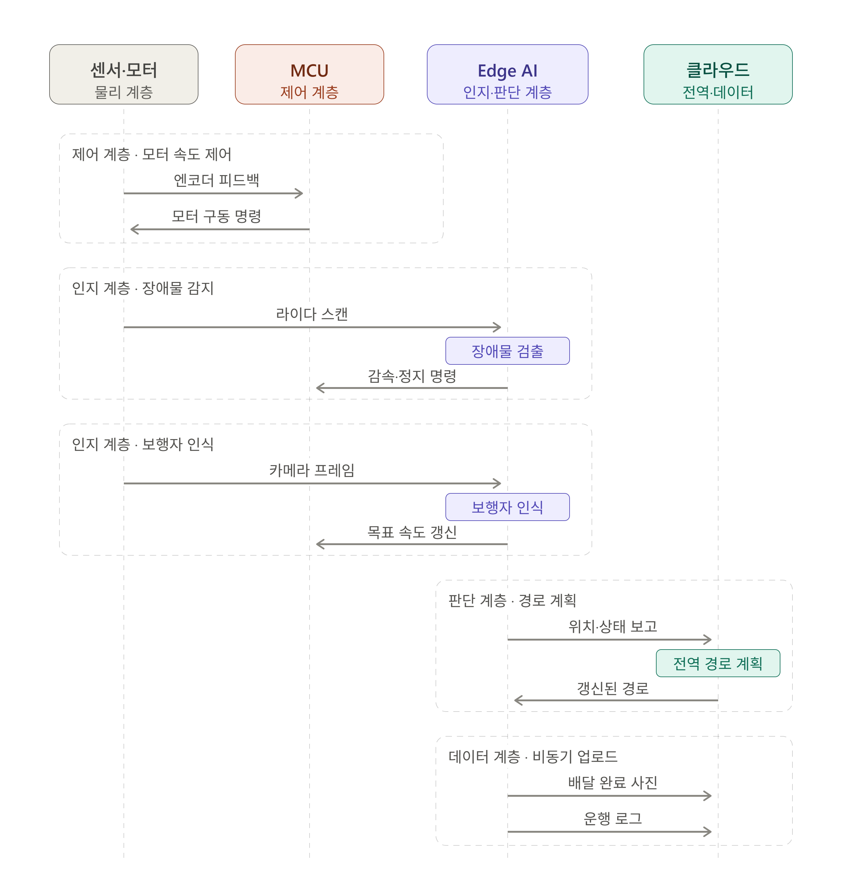
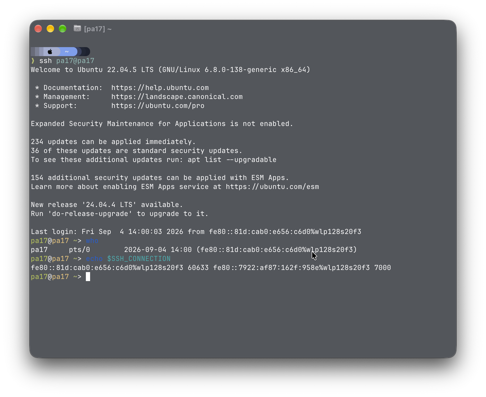
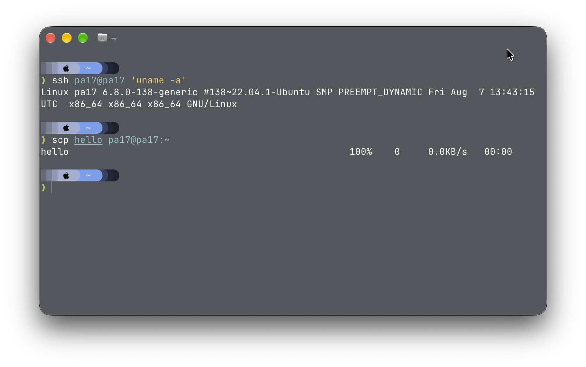
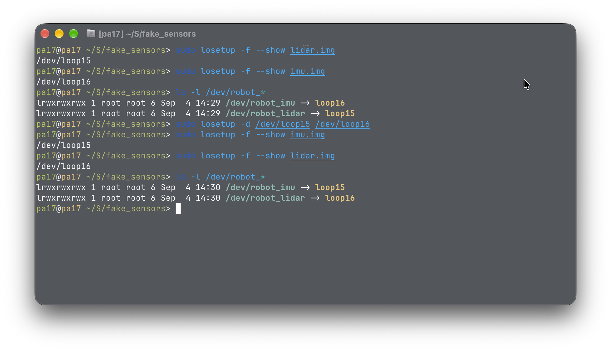
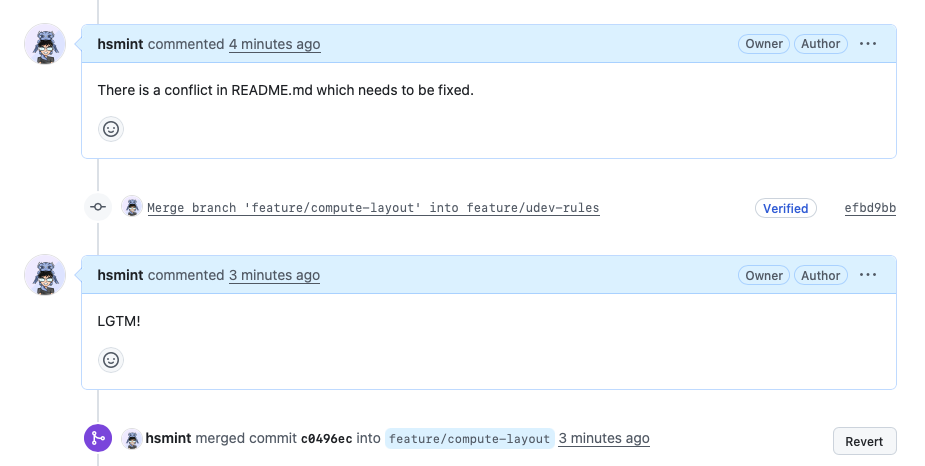
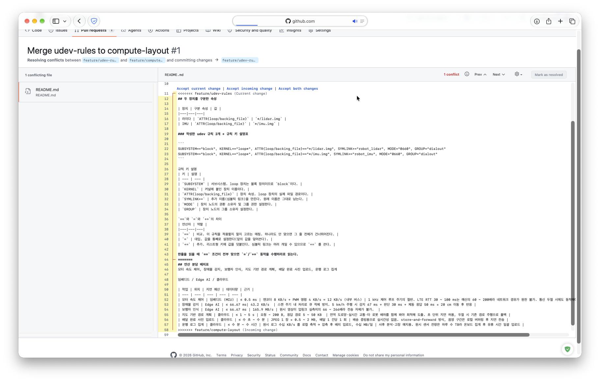

# 모듈 ① 과제 — 배달 로봇 온보딩

## 1. 배달 로봇의 연산 분담과 실시간성 설계

| 장치 | 갱신 주기 | 1회 데이터 | 데이터율 |
| --- | --- | --- | --- |
| 2D 라이다 | 15Hz(66.67ms) | 360 점 × (거리 4 B + 세기 4 B) = 2880 B | 43.2 kB/s |
| RGB 카메라 | 60fps (16.67ms) | 1280 x 720 x3 B = 2,764,800 B | 165.9 MB/s ≈ 1,327 Mbps |
| IMU | 400Hz (2.5ms) | 가속도 3축 + 각속도 3축 × 4 B + 타임스탬프 8 B = 32 B | 32 × 400 = 12.8 kB/s |
| 바퀴 엔코더 | 2kHz (0.5ms) | 2륜 × 4 B = 8 B | 8 × 2,000 = 16 kB/s |
| LTE | - | - | 업링크 95Mbps , 다운로드 100Mbps |

### 1-1. 연산 분담 배치표
모터 속도 제어, 장애물 감지, 보행자 인식, 지도 기반 경로 계획, 배달 완료 사진 업로드, 운행 로그 집계

임베디드 / Edge AI / 클라우드

| 작업 | 위치 | 지연 예산 | 데이터량 | 근거 |
| --- | --- | --- | --- | --- |
| 모터 속도 제어 | 임베디드 | ≤ 0.5 ms | 엔코더 8 KB/s + PWM 명령 4 KB/s = 12 KB/s | 1 kHz 제어 루프 주기의 절반. LTE RTT 30 ~ 100 ms는 예산의 60 ~ 200배라 네트워크 경유가 원천 불가. 통신 두절 시에도 동작해야 하는 안전 필수 경로 |
| 장애물 감지 | Edge AI | ≤ 66.67 ms| 43.2 KB/s  | 스캔 주기 내 처리로 큐 적체 방지. 5 km/h 주행 시 감지 67 ms + 판단 30 ms + 제동 응답 50 ms ≈ 20 cm 이동 후 반응 |
| 보행자 인식 | Edge AI | ≤ 66.67 ms | 165.9 MB/s | 원시 영상이 업링크 실측치의 66 ~ 266배라 전송 자체가 불가.  |
| 지도 기반 경로 계획 | 클라우드 | ≤ 1 ~ 5 s | 요청 ~ 200 B, 응답 경로 5 ~ 50 KB  | 전역 도로망·실시간 교통·타 로봇 배차를 함께 봐야 최적해 도출. 초 단위 지연 허용, 두절 시 기존 경로 주행으로 폴백 |
| 배달 완료 사진 업로드 | 클라우드 | ≤ 수 초 ~ 수 분 | JPEG 1 장 ≈ 0.5 ~ 2 MB, 배달 1 건당 1 회 | 배송 증빙용으로 실시간성 없음. store-and-forward 방식, 음영 구간은 로컬 버퍼링 후 지연 전송 |
| 운행 로그 집계 | 클라우드 | ≤ 수 분 ~ 수 시간 | 원시 로그 수십 KB/s 를 로컬 축적 → 압축 후 배치 업로드, 수십 MB/일 | 사후 분석·고장 예지용. 원시 센서 전량은 하루 수 TB라 온보드 집계 후 유휴 시간 일괄 업로드 |

### 1-2. 카메라 원시 영상 전송량

```
720p RGB 한 장 = 1280 x 720 x 3 B = 2,764,800 B ≈ 2.64 MB
60fps 이므로 2,764,800 B x 60 = 165,888,000 B/s ≈ 165.9 MB/s ≈ 158.2 MiB/s ≈ 1.327 Gbps
```
LTE 대비 LTE 업링크 95Mbps, 다운로드 100Mbps로는 원시 영상 전송이 불가능하다. 또한 지하나 터널 등 LTE 신호가 약한 환경에서는 연결이 끊길 수 있다.

### 1-3. 인지·판단·제어 계층 매핑과 주기표

| 계층 | 작업 | 실행 위치 | 입력 → 출력 |
| --- | --- | --- | --- |
| 인지 | 엔코더 읽기 | 임베디드 | 펄스 카운트 → 바퀴 각속도 |
| 인지 | IMU 읽기·자세 융합 | 임베디드/Edge | 가속도·각속도 → 자세·오도메트리 |
| 인지 | 장애물 감지 | Edge (+ MCU 비상정지) | 라이다 스캔 → 장애물 점군·최근접 거리 |
| 인지 | 보행자 인식 | Edge (GPU) | 카메라 프레임 → 보행자 바운딩박스·거리 |
| 판단 | 지도 기반 전역 경로 계획 | 클라우드 | 출발·목적지·지도 → waypoint 열 |
| 판단 | 국소 경로·속도 결정 | Edge | waypoint + 장애물 + 보행자 → 목표 선속도·각속도 |
| 제어 | 모터 속도 제어 (PID) | 임베디드 | 목표 속도 vs 엔코더 → PWM 듀티 |
| (비실시간) | 배달 완료 사진 업로드 | 클라우드 | JPEG → 저장·알림 |
| (비실시간) | 운행 로그 집계 | 클라우드 | 로그 파일 → 통계·대시보드 |




### 1-4. Hard / Firm / Soft 분류표

| 작업 | 등급 |
| --- | --- |
| 모터 속도 제어 | Hard |
| 장애물 감지 | Hard |
| 보행자 인식 | Firm |
| 지도 기반 경로 계획 | Soft |
| 배달 완료 사진 업로드 | Soft |
| 운행 로그 집계 | Soft |

**Hard 항목의 마감 초과 결과**

- 모터 속도 제어: 마감을 놓치면 의도한 속도를 넘어 가속하거나 진동이 발산한다.
- 장애물 감지: 마감을 놓치면 정지 거리가 늘어나며 충돌 위험이 증가한다.

### 1-5. 주기·지연·지터

- 주기 — 같은 일을 얼마나 자주 반복하는가. 이 로봇의 제어 루프는 0.5 ms 마다 한 번(2 kHz) 돈다. 라이더 장애물 감지는 15Hz 이다.
- 지연 — 원인이 생긴 시점부터 결과가 나올 때까지 걸린 시간. 라이다에 장애물이 찍힌 순간부터 바퀴가 실제로 멈추기 시작할 때까지가 약 100 ms 다(스캔 67 ms + 판단 20 ms + 제어·구동 10 ms).
- 지터 — 주기나 지연이 매번 얼마나 흔들리는가. 제어 루프가 평균 0.5 ms 로 돌더라도 OS 스케줄링 때문에 실제로는 0.3 ~ 0.7 사이로 실행되면 +-0.2ms 이고 이 편차는 PID의 dt를 오염시키기 때문에 Hard로 분류된 작업들은 최악 지터를 먼저 줄어야 한다.

세 가지는 서로 다른 것을 잰다 — 주기는 빈도, 지연은 총 소요, 지터는 흔들림이다. 실시간성을 말할 때 중요한 것은 평균이 아니라 최악값(worst case) 이다.

## 2. 원격 접속(SSH)과 센서 장치 경로 고정

### 2-1. 고른 접속 대상: `서브 노트북`



### 2-2. 개인키·공개키 중 서버에 등록하는 것

공개키를 서버에 등록합니다. 개인키로만 서명 생성하기 때문입니다. 공개키는 개인키로 서명된 메시지를 검증하는 데 사용되기 때문에 서버에 등록합니다.

### 2-3. 원격 단일 명령 실행과 `scp` 전송 출력

```bash
ssh pa17@pa17 'uname -a'

scp hello pa17@pa17:~
```



### 2-4. 두 장치를 구분한 속성

| 장치 | 구분 속성 | 값 |
|---|---|---|
| 라이다 | `ATTR{loop/backing_file}` | `*/lidar.img` |
| IMU | `ATTR{loop/backing_file}` | `*/imu.img` |

### 2-5. 작성한 udev 규칙 2개 + 규칙 키 설명표

```
SUBSYSTEM=="block", KERNEL=="loop*", ATTR{loop/backing_file}=="*/lidar.img", SYMLINK+="robot_lidar", MODE="0660", GROUP="dialout"
SUBSYSTEM=="block", KERNEL=="loop*", ATTR{loop/backing_file}=="*/imu.img", SYMLINK+="robot_imu", MODE="0660", GROUP="dialout"
```

규칙 키 설명
| 키 | 설명 |
| --- | --- |
| `SUBSYSTEM` | 서브시스템. loop 장치는 블록 장치이므로 `block`이다. |
| `KERNEL` | 커널에 붙인 장치 이름이다. |
| `ATTR{loop/backing_file}` | 장치 속성. loop 장치의 실제 파일 경로이다. |
| `SYMLINK+=` | 추가 이름(심볼릭 링크)을 만든다. 원래 이름은 그대로 남는다. |
| `MODE` | 장치 노드의 권환 소유자 및 그룹 권한 설정한다. |
| `GROUP` | 장치 노드의 그룹 소유자 설정한다. |

`==`와 `=`와 `+=`의 차이
| 연산자 | 역할 |
|---|---|
| `==` | 비교. 이 규칙을 적용할지 말지 고르는 매칭. 하나라도 안 맞으면 그 줄 전체가 건너뛰어진다. |
| `=` | 대입. 값을 통째로 설정한다(앞의 값을 덮어쓴다). |
| `+=` | 추가. 리스트형 키에 값을 덧붙인다. 심볼릭 링크는 여러 개일 수 있으므로 `+=` 를 쓴다. |

한줄을 읽을 때 `==` 조건이 전부 맞으면 `=`/`+=` 동작을 수행하라로 읽는다.

### 2-6. 순서를 바꿔 재연결한 뒤 `ls -l /dev/robot_*` 출력

```
sudo losetup -f --show lidar.img
sudo losetup -f --show imu.img

ls -l /dev/robot_* // 출력

// 순서를 바꿔 재연결
sudo losetup -f --show imu.img
sudo losetup -f --show lidar.img

ls -l /dev/robot_* // 출력
```



### 2-7. 실제 USB 센서용 규칙 초안과 구분 근거

```
SUBSYSTEM=="tty", ATTR{idVendor}=="10c4", ATTR{idVendor}=="ea60", SYMLINK+="robot_lidar", MODE="0660", GROUP="dialout"
SUBSYSTEM=="tty", ATTR{idVendor}=="10c4", ATTR{idVendor}=="ea70", SYMLINK+="robot_imu", MODE="0660", GROUP="dialout"
```

**`idVendor` 값이 같고 `idProduct` 값이 다른 경우**
idProduct으로 구분을 한다. 제조사가 같아도 제품 ID가 달라 서로 다른 장치로 인식한다.

## 3. 팀 저장소 협업 - 브랜치·충돌 해결·PR 리뷰

### 3-1. 저장소 URL / PR URL

- 저장소 URL: [`저장소 URL`](https://github.com/hsmint/simple-git-test)
- PR URL: [`PR URL`](https://github.com/hsmint/simple-git-test/pull/1)

### 3-2. PR리뷰 코멘트와 반영 커밋



### 3-3. 충돌이 난 파일과 줄



충돌이 난 파일: `README.md`

11번 줄부터 충돌 발생 했다.

충돌 표식
- `<<<<<<<`: Merge 시작 지점. 현재 브랜치의 내용이 이 아래에 위치한다.
- `=======`: Merge 구분 지점. 현재 브랜치와 병합하려는 브랜치의 내용이 이 아래에 위치한다.
- `>>>>>>>`: Merge 종료 지점. 병합하려는 브랜치의 내용이 이 위에 위치한다.

### 3-4. merge 방식 이력 그래프 / rebase 방식 이력 그래프

Rebase 방식 이력 그래프

```
* 7e48847 (HEAD -> main, feature/compute-layout) update: add compute layout section
| *   c0496ec (origin/feature/compute-layout) Merge pull request #1 from hsmint/feature/udev-rules
| |\
| | * efbd9bb (origin/feature/udev-rules) Merge branch 'feature/compute-layout' into feature/udev-rules
| |/|
|/|/
| * f9c71c7 update: add compute layout section
* | b2a7074 update: add udev rules section
|/
* c872caf (origin/main, origin/HEAD, main) Initial Commit 🚀
```

Merge 방식 이력 그래프

```
*   c0496ec (HEAD -> main, origin/feature/compute-layout, feature/compute-layout) Merge pull request #1 from hsmint/feature/udev-rules
|\
| *   efbd9bb (origin/feature/udev-rules) Merge branch 'feature/compute-layout' into feature/udev-rules
| |\
| |/
|/|
* | f9c71c7 update: add compute layout section
| * b2a7074 update: add udev rules section
|/
* c872caf (origin/main, origin/HEAD) Initial Commit 🚀
```

Merge 방식은 브랜치가 합쳐진 시점에 merge commit이 생기고, rebase 방식은 브랜치가 합쳐지면서 commit들이 재배치되어 merge commit이 생기지 않는다. 따라서 rebase 방식은 이력이 더 깔끔하게 보인다.

### 3-5. 언제 merge를, 언제 rebase를 쓸지

- merge: 여러 개발자가 동시에 작업하는 경우, 각자의 브랜치를 유지하면서 병합할 때 사용한다. 충돌 해결 후 병합 커밋을 남기므로 이력이 명확하게 남는다.
- rebase: 이력이 깔끔하게 유지되며, 병합 커밋이 생기지 않아 히스토리가 단순해진다. 공유된 이력을 rebase하면 전체의 저장소가 꼬이기 때문에 개인이 가진 로컬 커밋에만 사용한다.
