# 모듈 ② 과제 — turtlesim 기반 C++·Python ROS2 패키지 개발

## 1. C++ 빌드 체계 세우기 - g++ 다중 파일 빌드와 CMake 전환

### 1-1. **수동 2단계 빌드 명령** (터미널 입력)
```bash
g++ -Wall -std=c++17 -c main.cpp motor.cpp

g++ -Wall -std=c++17 main.o motor.o -o main
```

### 1-2. **`undefined reference` 에러 메시지** (출력) - 컴파일 에러와의 차이 설명


### 1-3. **CMake빌드 출력** (터미널 출력)


### 1-4. 증분 빌드 시 재컴파일된 파일

`motor.cpp` 파일만 재컴파일 됩니다. 그렇게 판단한 이유는 `main.cpp` 파일은 수정되지 않았기 때문에, 이전에 컴파일된 `main.o` 파일을 재사용하고, 변경된 `motor.cpp` 파일만 새로 컴파일하여 `motor.o` 파일을 생성합니다. 따라서 증분 빌드 시에는 변경된 소스 파일만 재컴파일되어 빌드 시간을 단축시킬 수 있습니다.

## 2. 현대 C++로 센서 계층 구현 - RAII·다형성·STL
### 2-1. 다형성 루프 출력

```
./loop_demo
다형성 루프
[생성] Sensor (front_lidar)
[생성] Lidar
[생성] Sensor (body_imu)
[생성] Imu
[소멸] ~Imu
[소멸] ~Sensor (body_imu)
[소멸] ~Lidar
[소멸] ~Sensor (front_lidar)
```

Virtual 소멸자를 사용했기 때문에, `Sensor` 포인터를 통해 `Lidar`와 `Imu` 객체를 삭제할 때, 각각의 파생 클래스의 소멸자가 호출됩니다. 따라서 `~Lidar`와 `~Imu`가 먼저 호출되고, 그 후에 `~Sensor`가 호출됩니다.

### 2-2. 스택 객체와 힙 객체의 소멸 시점 - 관찰 로그와 설명

```
❯ ./heap_stack_demo
스택 vs 힙 — 생성/소멸 시점 관찰

[생성] Sensor (imu_on_heap)
[생성] Imu
[스코프 진입]
[생성] Sensor (imu_on_stack)
[생성] Imu
[스코프 끝 직전]
[소멸] ~Imu
[소멸] ~Sensor (imu_on_stack)
[소멸] ~Imu
[소멸] ~Sensor (imu_on_heap)
```

스택 객체와 힙 객체의 소멸 시점은 다릅니다. 스택 객체는 함수를 벗어날 때 자동으로 소멸되며, 힙 객체는 명시적으로 `delete`를 호출해야 소멸됩니다. 위 로그에서 `imu_on_stack` 객체는 스코프가 끝나면서 자동으로 소멸되고, `imu_on_heap` 객체는 프로그램 종료 시점에 소멸됩니다.

### 2-3. 가상 소멸자를 뺐을 때의 차이

가상 소멸자를 제거하면, `Sensor` 포인터를 통해 `Lidar`와 `Imu` 객체를 삭제할 때, 파생 클래스의 소멸자가 호출되지 않습니다. 따라서 `~Lidar`와 `~Imu`가 호출되지 않고, 메모리 누수가 발생할 수 있습니다. 이로 인해 리소스가 해제되지 않아 프로그램 종료 시점에 메모리 누수가 발생할 수 있습니다.

### 2-4. `count_if` 결과

```
❯ ./count_demo
[생성] Sensor (front_lidar)
[생성] Lidar
[생성] Sensor (body_imu)
[생성] Imu
unordered_map / vector / count_if
  latest[body_imu] = -0.01
  latest[front_lidar] = 1
  목표 (2.1, 3) 에서 0.35 m 이내 기록: 5 / 7 개
[소멸] ~Imu
[소멸] ~Sensor (body_imu)
[소멸] ~Lidar
[소멸] ~Sensor (front_lidar)
```

0.35 이내 기록 이 5개이고, 총 기록이 7개이다.

### 2-5. 누수 검출 결과 -> 수정 후 결과

`new`를 사용하여 동적 할당한 경우 `delete`를 호출하지 않으면 발생되는 결과

**fasanitize**를 사용하여 메모리 누수를 검출한 결과

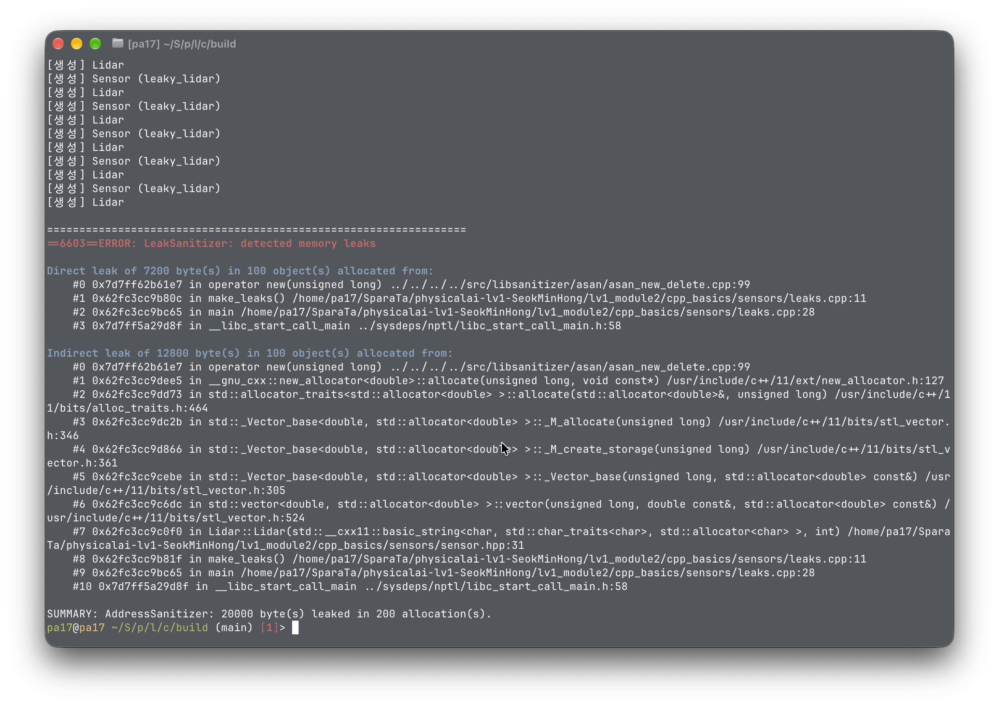

**valgrind**를 사용하여 메모리 누수를 검출한 결과

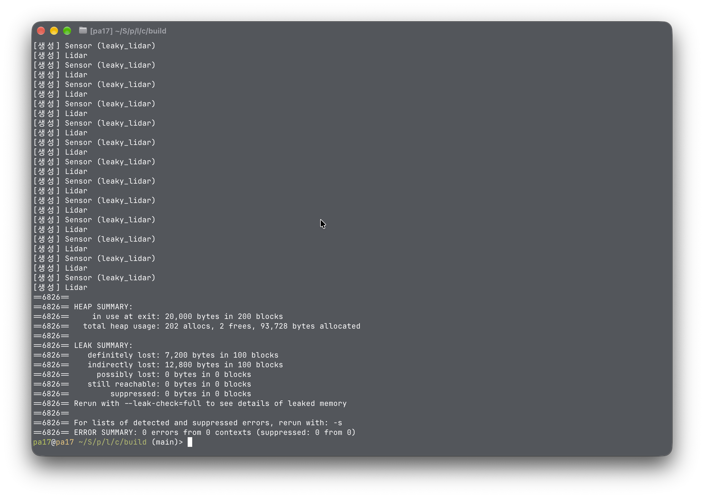

fsanitize와 valgrind 모두 메모리 누수를 검출합니다. `delete`를 호출하여 메모리를 해제하면, 더 이상 메모리 누수가 발생하지 않습니다.

`make_unique`를 사용하여 스마트 포인터 사용할 경우

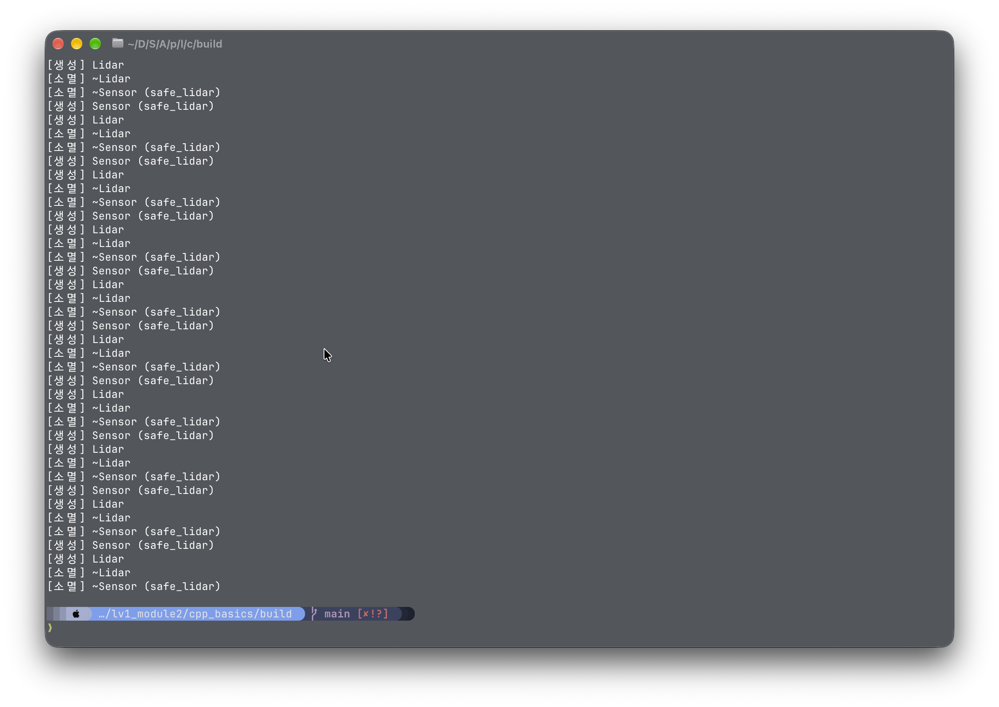

결과: 스마트 포인터를 사용하여 동적 할당된 객체를 자동으로 관리하면, 메모리 누수를 방지할 수 있습니다. 스마트 포인터는 객체의 소유권을 관리하며, 더 이상 필요하지 않을 때 자동으로 메모리를 해제합니다.

## 3. rclpy 노드 작성 - 거북이 상태 발행자와 구독자

### 3-1. `/turtle1/pose` 필드 구성

```
❯ ros2 topic echo /turtle1/pose
x: 5.544444561004639
y: 5.544444561004639
theta: 0.0
linear_velocity: 0.0
angular_velocity: 0.0
---
```

```
❯ ros2 interface show /turtlesim/msg/Pose
float32 x
float32 y
float32 theta

float32 linear_velocity
float32 angular_velocity
```

### 3-2. `ros2 topic hz /turtle_distance`

출력이 대략 9.998 (10hz 근접) 한다.

```
ros2 topic hz /turtle_distance
```

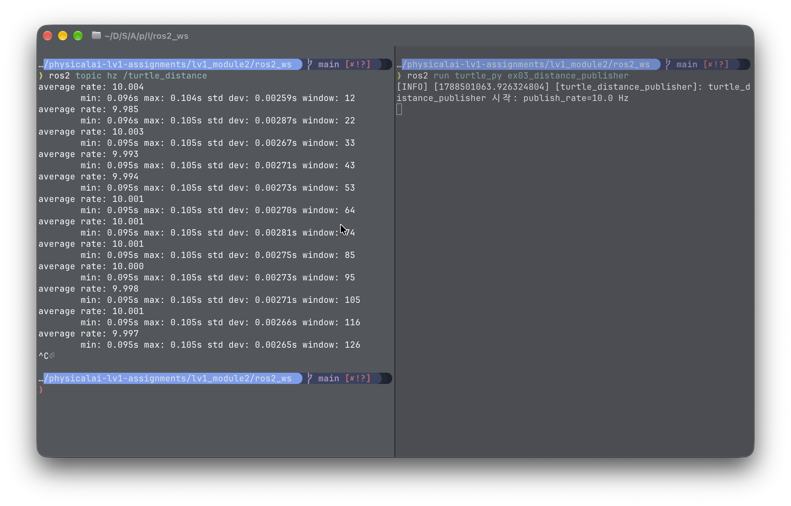

### 3-3. 구독자 경고 로그 (터미널 출력)


### 3-4. 구독자 2개 동시 수신 확인 (양쪽 로그)

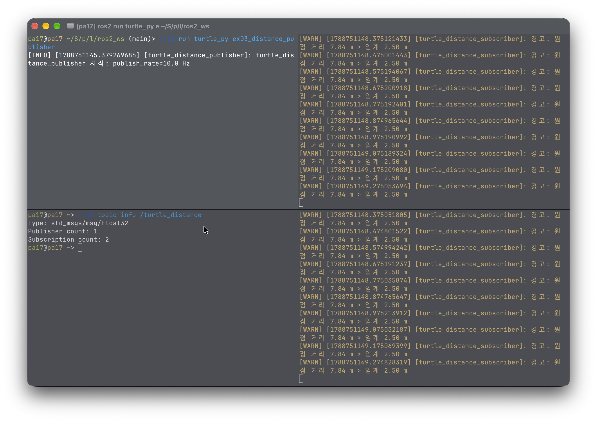


### 3-5. 주행 캡쳐 (turtlesim 화면)

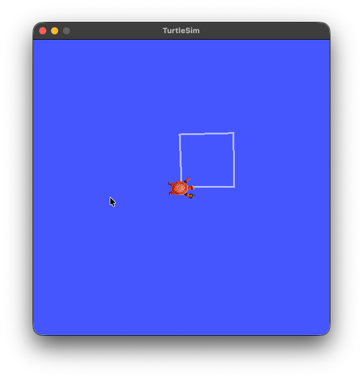

### 3-6. Ctrl+C 정상 종료 화면 (출력)

```
❯ ros2 run turtle_py ex03_distance_publisher
[INFO] [1788751205.927320333] [turtle_distance_publisher]: turtle_distance_publisher 시작: publish_rate=10.0 Hz
[INFO] [1788751205.927668085] [turtle_distance_publisher]: DistancePublisher 노드가 시작되었습니다. Ctrl+C 로 종료합니다.
[WARN] [1788751206.025237845] [turtle_distance_publisher]: 아직 /turtle1/pose 를 받지 못했습니다
[WARN] [1788751207.025803721] [turtle_distance_publisher]: 아직 /turtle1/pose 를 받지 못했습니다
[WARN] [1788751208.126126204] [turtle_distance_publisher]: 아직 /turtle1/pose 를 받지 못했습니다
^C[INFO] [1788751209.112969163] [turtle_distance_publisher]: Ctrl+C — 정상 종료합니다
```

## 4. rclcpp 노드 작성 — C++ 발행자와 구독자

### 4-1. `colcon build` 성공 출력

```
pa17@pa17 ~/S/p/l/ros2_ws (main)> colcon build
Starting >>> turtle_interfaces
Starting >>> turtle_cpp
Finished <<< turtle_interfaces [3.45s]
Starting >>> turtle_py
Finished <<< turtle_py [0.44s]
Finished <<< turtle_cpp [5.41s]

Summary: 3 packages finished [5.52s]
```

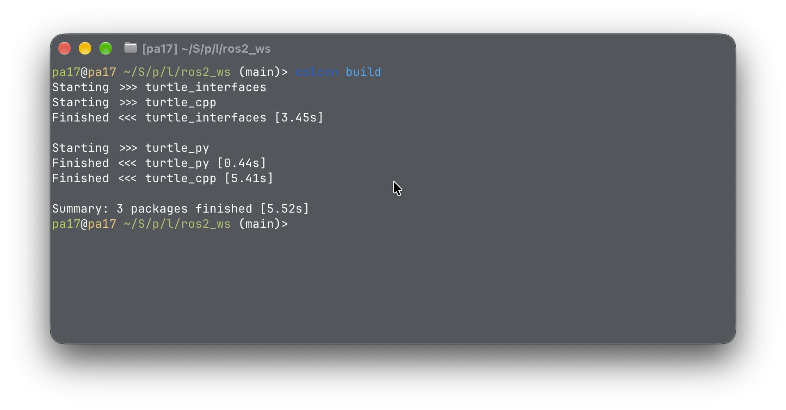

### 4-2. rclpy 발행에서 rclpp 구독까지 이어진 로그

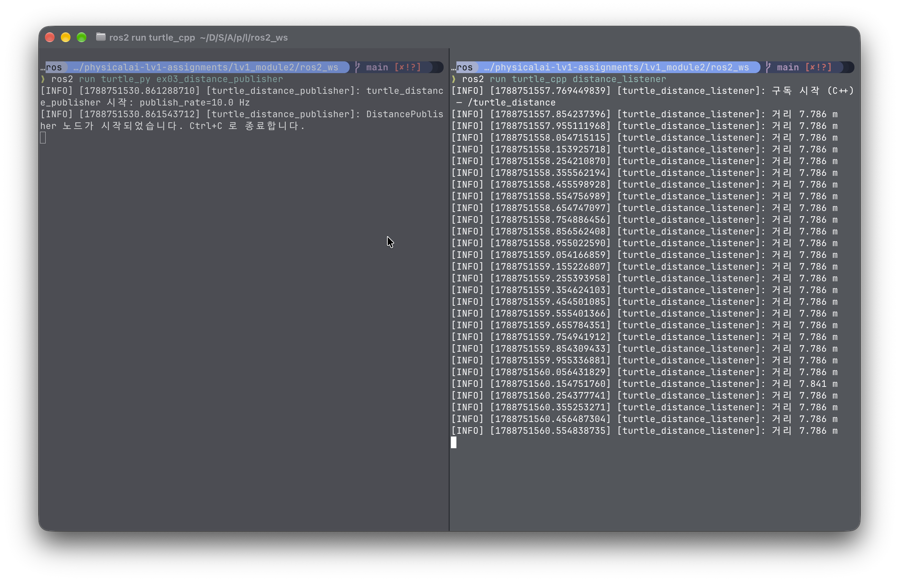

### 4-3. rclpy와 rclcpp 대응 관계표 - 노드 생성 / 타이머 / 콜백/ 종료

| 종류 | rclpy | rclcpp |
|---|---|---|
| 노드 생성 | `Node("node_name")` | `rclcpp::Node::make_shared("node_name")` |
| 타이머 생성 | `self.create_timer(period, callback)` | `this->create_wall_timer(period, callback)` |
| 콜백 함수 | 함수 객체 그대로 | `std::bind(&ClassName::callback, this)` |
| 종료 | `rclpy.shutdown()` | `rclcpp::shutdown()` |

## 10. 시각화·기록·테스트로 검증하기

### 10-1. `rqt_graph` 캡쳐


### 10-2. RViz2 TF + 경유점 마커 캡쳐

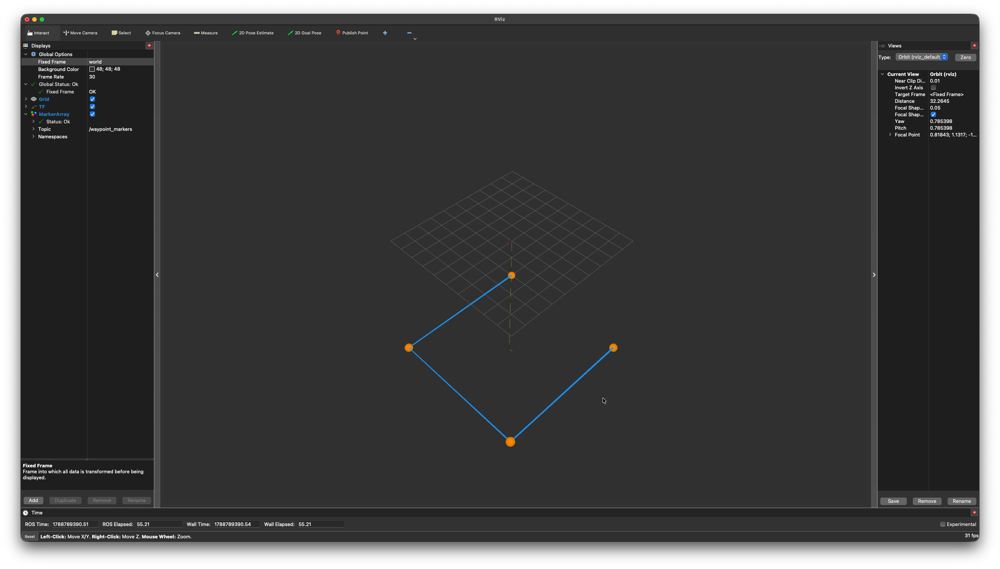

### 10-3 `ros2 bag play` 재생 중 구독자 로그 - 기록된 토픽과 메시지 수

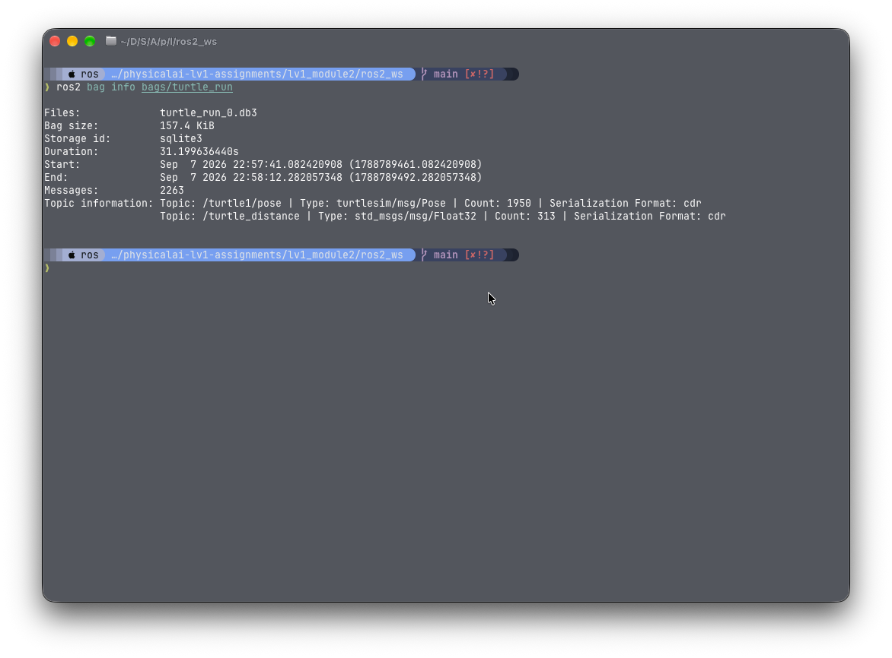

`ros2 bag play` 재생 중 구독자 로그

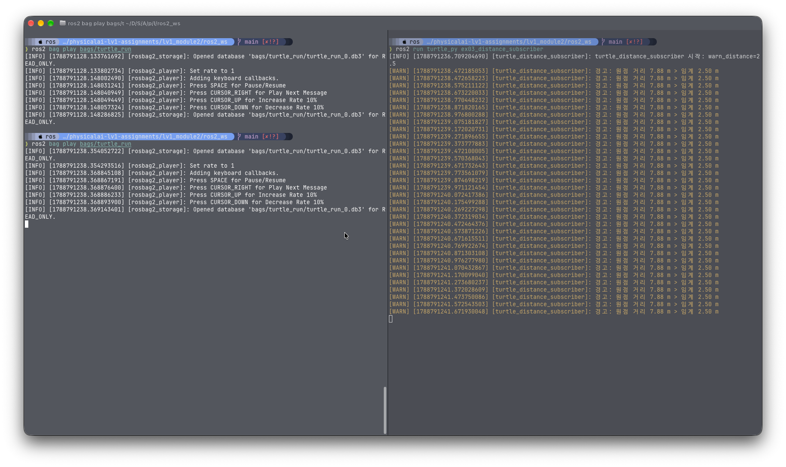

기록된 토픽과 메시지 수:
- `/turtle1/pose` : 1950개
- `/turtle_distance` : 313개

### 10-4 `pytest` 통과 출력

|대상 | 정상 입력 | 경계값 | 예외 상황 |
|---|---|---|---|
| 목표까지의 거리 `distance_to_origin` / `distance_between` | 3-4-5 삼각형, turtlesim 시작 위치 | 원점 자신(0), 같은 두 점(0) | 숫자가 아닌 입력 → `TypeError`/`ValueError` |
| 목표를 향한 각도 `normalize_angle` / `angle_to_goal` | 0도·90도·-90도 | 정확히 뒤(±pi), 한 바퀴(2pi+0.3), 3pi | 정규화가 없으면 pi 를 넘는 값 → 항상 짧은 쪽인지 확인 |
| 경유점 도달 판정 `is_reached` | 안/밖 각각 | 거리 == 허용 오차(포함), 허용 오차 0 | 음수 허용 오차 → `ValueError` |

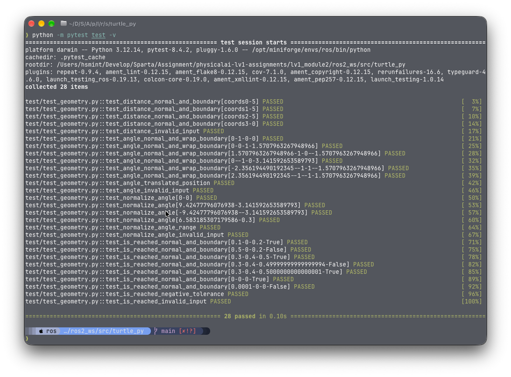

### 10-5 함수를 틀리게 바꿨을 때 실패 출력

```
return math.hypot(gx - x, gy - y) -> return math.hypot(gx - y, gy - x)
```

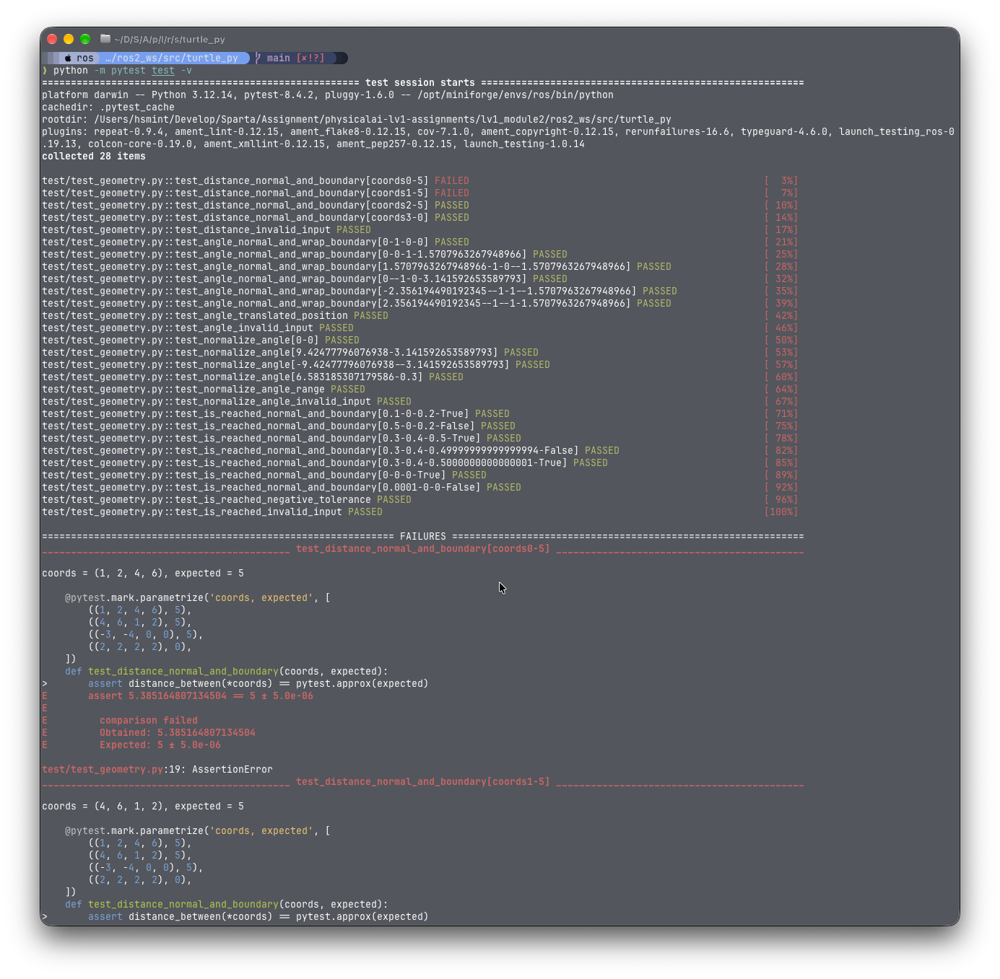

### 10-6 예외 처리·logging 동작 확인

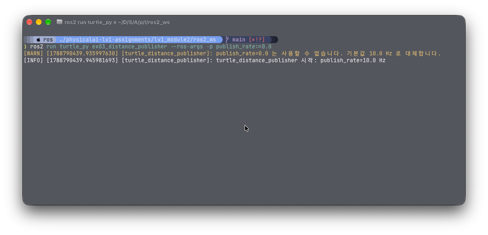
