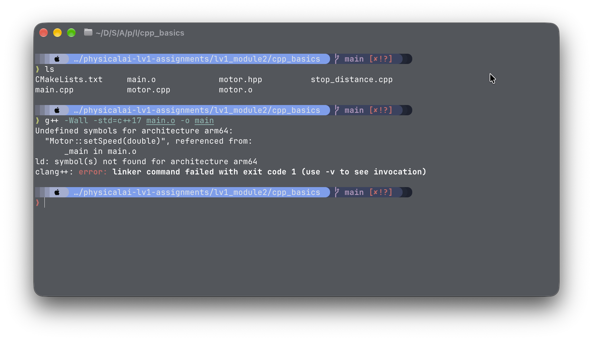
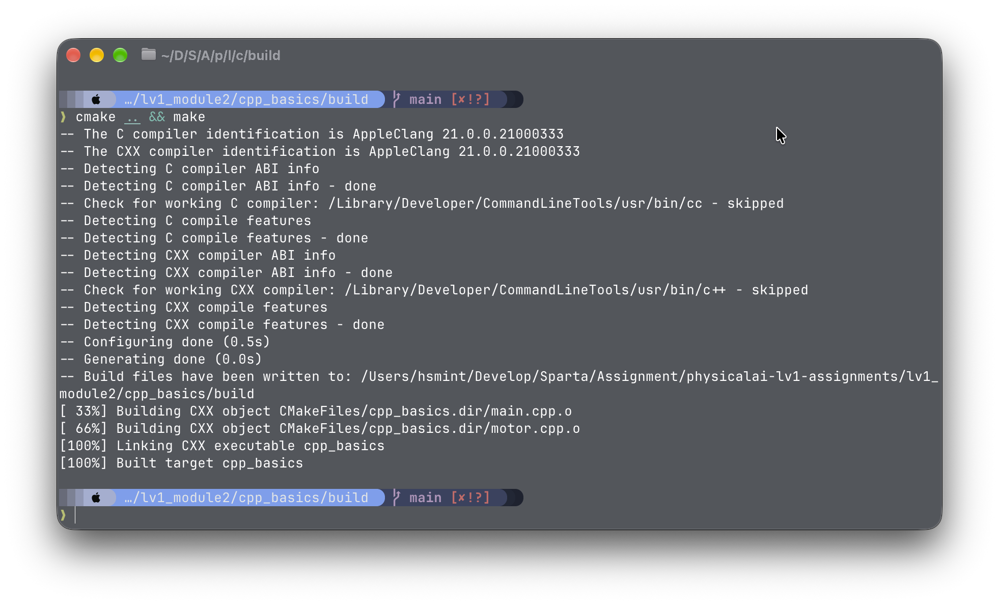
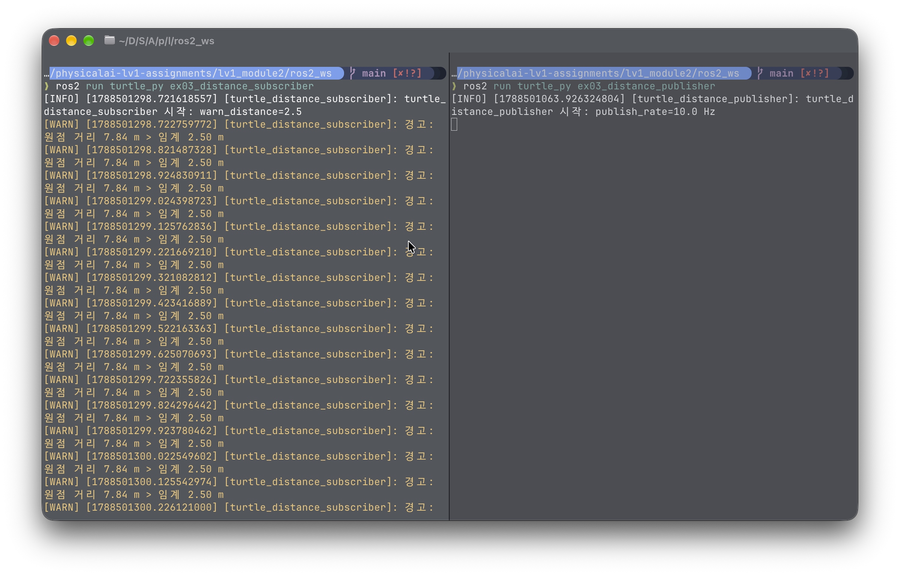

# 모듈 ② 과제 — turtlesim 기반 C++·Python ROS2 패키지 개발

## 1. C++ 빌드 체계 세우기 - g++ 다중 파일 빌드와 CMake 전환

### 1-1. **수동 2단계 빌드 명령** (터미널 입력)
```bash
g++ -Wall -std=c++17 -c main.cpp motor.cpp

g++ -Wall -std=c++17 main.o motor.o -o main
```

### 1-2. **`undefined reference` 에러 메시지** (출력) - 컴파일 에러와의 차이 설명



### 1-3. **CMake빌드 출력** (터미널 출력)



### 1-4. 증분 빌드 시 재컴파일된 파일

`motor.cpp` 파일만 재컴파일 됩니다. 그렇게 판단한 이유는 `main.cpp` 파일은 수정되지 않았기 때문에, 이전에 컴파일된 `main.o` 파일을 재사용하고, 변경된 `motor.cpp` 파일만 새로 컴파일하여 `motor.o` 파일을 생성합니다. 따라서 증분 빌드 시에는 변경된 소스 파일만 재컴파일되어 빌드 시간을 단축시킬 수 있습니다.

## 2. 현대 C++로 센서 계층 구현 - RAII·다형성·STL
### 2-1. 다형성 루프 출력

```
./loop_demo
다형성 루프
[생성] Sensor (front_lidar)
[생성] Lidar
[생성] Sensor (body_imu)
[생성] Imu
[소멸] ~Imu
[소멸] ~Sensor (body_imu)
[소멸] ~Lidar
[소멸] ~Sensor (front_lidar)
```

Virtual 소멸자를 사용했기 때문에, `Sensor` 포인터를 통해 `Lidar`와 `Imu` 객체를 삭제할 때, 각각의 파생 클래스의 소멸자가 호출됩니다. 따라서 `~Lidar`와 `~Imu`가 먼저 호출되고, 그 후에 `~Sensor`가 호출됩니다.

### 2-2. 스택 객체와 힙 객체의 소멸 시점 - 관찰 로그와 설명

```
❯ ./heap_stack_demo
스택 vs 힙 — 생성/소멸 시점 관찰

[생성] Sensor (imu_on_heap)
[생성] Imu
[스코프 진입]
[생성] Sensor (imu_on_stack)
[생성] Imu
[스코프 끝 직전]
[소멸] ~Imu
[소멸] ~Sensor (imu_on_stack)
[소멸] ~Imu
[소멸] ~Sensor (imu_on_heap)
```

스택 객체와 힙 객체의 소멸 시점은 다릅니다. 스택 객체는 함수를 벗어날 때 자동으로 소멸되며, 힙 객체는 명시적으로 `delete`를 호출해야 소멸됩니다. 위 로그에서 `imu_on_stack` 객체는 스코프가 끝나면서 자동으로 소멸되고, `imu_on_heap` 객체는 프로그램 종료 시점에 소멸됩니다.

### 2-3. 가상 소멸자를 뺐을 때의 차이

가상 소멸자를 제거하면, `Sensor` 포인터를 통해 `Lidar`와 `Imu` 객체를 삭제할 때, 파생 클래스의 소멸자가 호출되지 않습니다. 따라서 `~Lidar`와 `~Imu`가 호출되지 않고, 메모리 누수가 발생할 수 있습니다. 이로 인해 리소스가 해제되지 않아 프로그램 종료 시점에 메모리 누수가 발생할 수 있습니다.

### 2-4. `count_if` 결과

```
❯ ./count_demo
[생성] Sensor (front_lidar)
[생성] Lidar
[생성] Sensor (body_imu)
[생성] Imu
unordered_map / vector / count_if
  latest[body_imu] = -0.01
  latest[front_lidar] = 1
  목표 (2.1, 3) 에서 0.35 m 이내 기록: 5 / 7 개
[소멸] ~Imu
[소멸] ~Sensor (body_imu)
[소멸] ~Lidar
[소멸] ~Sensor (front_lidar)
```

0.35 이내 기록 이 5개이고, 총 기록이 7개이다.

### 2-5. 누수 검출 결과 -> 수정 후 결과


## 3. rclpy 노드 작성 - 거북이 상태 발행자와 구독자

### 3-1. `/turtle1/pose` 필드 구성

```
❯ ros2 topic echo /turtle1/pose
x: 5.544444561004639
y: 5.544444561004639
theta: 0.0
linear_velocity: 0.0
angular_velocity: 0.0
---
```

```
❯ ros2 interface show /turtlesim/msg/Pose
float32 x
float32 y
float32 theta

float32 linear_velocity
float32 angular_velocity
```

### 3-2. `ros2 topic hz /turtle_distance`

출력이 대략 9.998 (10hz 근접) 한다.

```
ros2 topic hz /turtle_distance
```


### 3-3. 구독자 경고 로그 (터미널 출력)



### 3-4. 구독자 2개 동시 수신 확인 (양쪽 로그)


### 3-5. 주행 캡쳐 (turtlesim 화면)


### 3-6. Ctrl+C 정상 종료 화면 (출력)
