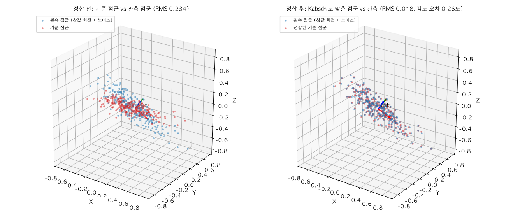
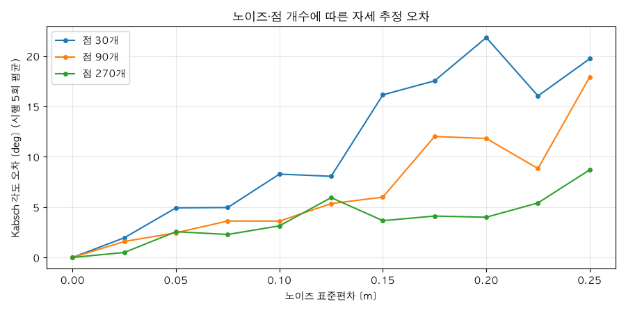
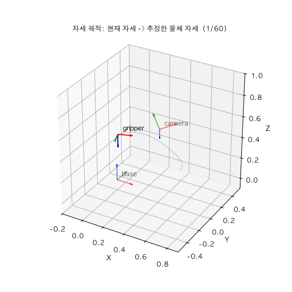

# 모듈 ④ 발표 자료 — 픽앤플레이스 자세 추정과 궤적 생성

> 이름: 홍석민 / 제출일: 2026-09-09
---

## 1. 파이프라인 전체 구조

- 좌표계 체인 (base -> link -> camera -> object) 그림 또는 다이어그램:

```
 base ──T_base_link──> link ──T_link_camera──> camera ──T_camera_object──> object
   │      rot_z(30°)          rot_y(-20°)@rot_x(90°)      점군 중심 + PCA 주축
   │      (0.30, 0.00, 0.40)  (0.10, 0.05, 0.15)          (0.05, -0.02, 0.60)
   └── 모든 계산의 기준 프레임: 목표 자세는 T_base_camera 로 base 로 옮겨서 쓴다
```

- 각 노트북·모듈이 맡는 역할 (01 파이프라인 / 02 보간 / 03 자세 추정·시연)

| 노트북 | 맡은 일 |
|---|---|
| 01 파이프라인 | venv/커널 검증, 네 좌표계 모델링, `PosePipeline` 로 camera -> base 점군 변환과 왕복 검증, 관절 각도 −30°/0°/+30° 스윕 |
| 02 보간 | 행렬 ↔ 쿼터니언 왕복, SLERP(SciPy 대조), 선형/큐빅 스플라인/5차 다항식 궤적과 속도·가속도 비교 |
| 03 자세 추정·시연 | PCA 주축, Kabsch 정합, 최소제곱 평면 피팅 + 이상치 제거, 목표 자세까지의 SLERP+스플라인 궤적 애니메이션 | 

- 모듈 ③ 에서 가져온 함수와 이번에 새로 만든 함수 구분

| 구분 | 파일 | 함수 |
|---|---|---|
| 재사용 | `vectors.py`, `rotation.py`, `transform.py`, `coordinate_chain.py` | `rot_x/rot_y/rot_z`, `rodrigues`, `axis_angle_from_matrix`, `is_rotation`, `make_T`, `inv_T`, `transform_points`, `CoordinateChain`, `default_chain` |
| 신규 | `pose_pipeline.py` | `PosePipeline` (`camera_to_base`, `base_to_camera`, `T_base_camera`, `T_camera_base`) |
| 신규 | `quaternion.py` | `matrix_to_quaternion`, `quaternion_to_matrix`, `quat_angle`, `slerp`, `lerp_quat` |
| 신규 | `trajectory.py` | `linear_interp`, `cubic_spline_interp`, `quintic_profile`, `finite_diff` |
| 신규 | `pose_estimation.py` | `pca_axes`, `kabsch`, `fit_plane_lstsq`, `remove_outliers` |
| 제공 | `plot3d.py` | `plot_point_cloud`, `animate_frames` |

---

## 2. 자세 추정 결과와 오차

- PCA 주축 3개와 고유값

| 축 | 고유값 λ |
|---|---|
| e1 (긴 축, ≈ −x) | 0.099500 | 
| e2 (≈ +y) | 0.010287 |
| e3 (짧은 축, ≈ −z) | 0.002548 |

- Kabsch 로 추정한 회전과 참값 사이 각도 오차: 0.2582도, 병진 오차: 0.0001 m

- 이상치 제거 전후 오차: 2.42도 -> 0.18도

- 정합 전후 그림


---

## 3. 노이즈·점 개수가 정확도에 미친 영향

- 노이즈 0 ~ 0.25 스윕에서 오차가 어떻게 커졌는가

| N \ σ | 0 | 0.025 | 0.05 | 0.075 | 0.10 | 0.125 | 0.15 | 0.175 | 0.20 | 0.225 | 0.25 |
|---|---|---|---|---|---|---|---|---|---|---|---|
| 30 | 0.00 | 1.95 | 4.92 | 4.95 | 8.27 | 8.06 | 16.14 | 17.53 | 21.83 | 16.04 | 19.73 |
| 90 | 0.00 | 1.59 | 2.45 | 3.62 | 3.61 | 5.34 | 5.99 | 12.01 | 11.81 | 8.83 | 17.92 |
| 270 | 0.00 | 0.50 | 2.56 | 2.28 | 3.13 | 5.94 | 3.65 | 4.11 | 3.99 | 5.42 | 8.70 |

- 노이즈 0 ~ 0.25 스윕에서 오차가 어떻게 커졌는가: σ=0 에서 1e-4도 미만, 이후 σ에 거의 비례합니다 (30점, σ 0.1 → 0.25 에서 8.27 → 19.73도).
  곡선이 오르내리는 것은 5회 평균이라 표본 변동이 남아서입니다.
- 점 개수 30 / 90 / 270 계열 비교 — 점이 많을수록 오차가 줄어드는 정도 (대략 몇 배): σ=0.25 에서 19.73 → 17.92 → 8.70도(약 2.3배), σ=0.20 에서 21.83 → 11.81 → 3.99도(약 5.5배). Kabsch 는 교차공분산의 SVD 라 독립 노이즈가 상쇄되어 오차가 **σ/√N** 로 줄어듭니다.
- 구형 점군에서 PCA 주축이 불안정해진 이유 (고유값 관점): λ1 ≈ λ2 이면 고유공간이 2차원이 되어 주축 방향이 정해지지 않고, 표본 잡음이 그 평면 안에서
  방향을 임의로 고르기 때문입니다.
- 오차 그래프:


---

## 4. 현재 구현의 한계

- 자세 추정
  - `kabsch` 는 두 점군의 대응(i번째 ↔ i번째)이 이미 알려진 경우**에만 동작합니다. 실제 센서 점군은
    대응이 없으므로 그대로는 쓸 수 없습니다.
  - `pca_axes` 는 고유벡터의 부호가 정해지지 않습니다**. 이번 결과도 e1 이 −x 를 향해
    참값과 180도 뒤집힌 축이 나왔습니다. det = +1 만 맞추므로 회전행렬이긴 하지만 물체의 앞/뒤는 구분하지 못합니다.
  - λ1 ≈ λ2 인 대칭·구형 물체에서는 3절처럼 주축이 70도 넘게 흔들립니다.
  - 이상치 제거가 평면 모델 + 잔차 3σ 한 가지에 의존합니다. 물체가 평면이 아니거나
    이상치가 30% 이상이면 피팅한 평면 자체가 오염되어 임계값이 무의미해집니다.
- 궤적 생성
  - 충돌 회피가 없습니다. 경유점을 손으로 0.15 m 들어 올려 우회를 흉내 냈을 뿐, 장애물을 보지 않습니다.
  - 관절 한계·속도·가속도 상한을 반영하지 않습니다. 시간 파라미터가 0~1 정규화 값이라 실제 초 단위 속도로 환산하면 상한을 넘을 수 있습니다.
- 파이프라인
  - 관절 1개(link의 z축 회전)로 단순화한 체인이고, 카메라 캘리브레이션(손-눈) 오차를 0으로 가정합니다. 실제로는 `T_link_camera` 오차가 그대로 목표 자세 오차로 넘어옵니다.
- 시연



---

## 5. 개선한다면 무엇을 어떻게

| 무엇을 | 어떻게 | 측정 방법 |
|---|---|---|
| 대응 없는 정합 | PCA 주축으로 초기 자세를 잡고 ICP 로 반복 정련 (최근접점 대응 → Kabsch → 수렴까지 반복) | 같은 시드에서 각도·병진 오차, 반복 횟수 대비 RMS 수렴 곡선 |
| 이상치 강건성 | 최소제곱 평면 → RANSAC 평면 피팅으로 교체, Kabsch 도 강건 손실(Huber)로 가중 | 이상치 비율을 5 → 50% 로 올리며 각도 오차 곡선 비교 (현재 3σ 방식과 같은 축에) |
| PCA 축 부호 모호성 | 점군의 3차 모멘트(왜도) 부호나 CAD 템플릿 매칭으로 축 방향을 확정 | 물체를 180도 뒤집은 100회 시행에서 축 부호가 뒤집히는 비율 |
| 궤적 품질 | 정지-정지 구간에 **5차(최소 저크) 다항식** 적용 + 속도·가속도 상한으로 시간 스케일링 | 저크 최댓값, 가속도 점프, 상한 위반 프레임 수 |
| 충돌·관절 한계 | 작업 공간 궤적을 역기구학으로 관절 공간에 내리고, 관절 한계 안에서 RRT 등으로 경유점 생성 | 계획 성공률, 충돌 검사 통과율, 경로 길이 |
| 캘리브레이션 오차 | 손-눈 캘리브레이션(AX = XB)으로 `T_link_camera` 를 추정해 보정 | 보정 전/후 base 기준 목표 위치의 반복 재현 오차 |

---

### 부록 - 재현 정보

- 주요 패키지: `numpy==2.5.2`, `scipy==1.18.1`, `matplotlib==3.11.1`, `pillow==12.3.0`,
  `pytest==9.1.1`, `jupyterlab==4.6.3`, `ipykernel==7.3.0`, `imageio==2.37.4`
- 난수 시드: `np.random.default_rng(42)` — 셀 실행 순서가 바뀌면 난수 순서도 바뀌므로 반드시 Restart & Run All
- 세 노트북 Restart Kernel and Run All Cells: 통과 
- `demo.gif` 프레임 수: 60 프레임
